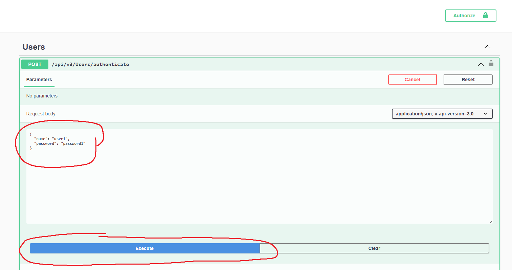
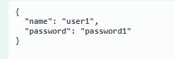
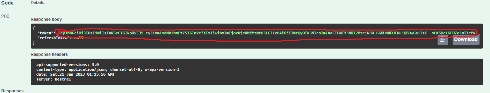
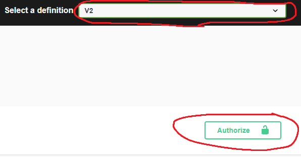
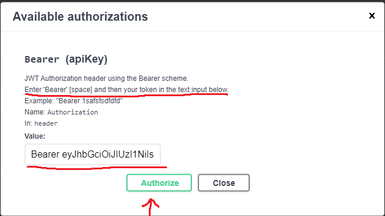
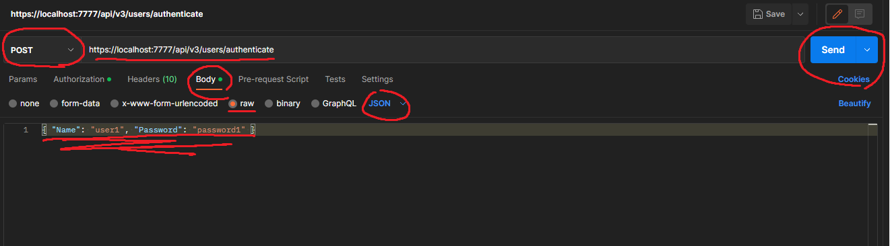
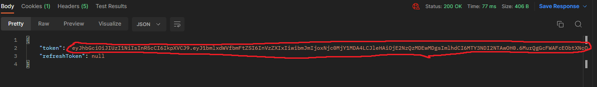
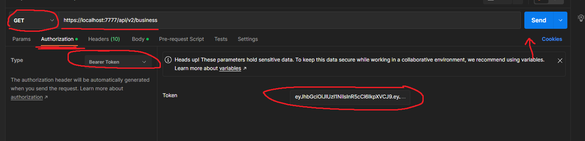

# Local Business API

#### Local Business API that functions as an archive for local businesses.

#### By [Brian Noh](https://github.com/noh24)

## Technologies Used

- C#
- .NET 6.0
- ASP.NET Core
- MVC/API architecture
- Pagination
- Versioning

## Description
Local Business API that functions as an archive for local businesses. The user can retrieve and post information regarding local businesses.

---

## Setup/Installation Requirements

### Install MySQL Workbench
  [Download and install the appropriate version of MySQL Workbench](https://dev.mysql.com/downloads/workbench/).
### Install .NET SDK
  [Download and install .NET 6 SDK](https://dotnet.microsoft.com/en-us/download/dotnet/6.0)
### Install Postman
(Optional) [Download and install Postman](https://www.postman.com/downloads/).
### Clone this repository to your Desktop:
  * Your computer will need to have GIT installed. If you do not currently have GIT installed, [follow these directions](https://docs.github.com/en/get-started/quickstart/set-up-git) for installing and setting up GIT.
  * Once GIT is installed, open up your system Terminal or GitBash, navigate to your desktop with the command `cd Desktop` or whichever location suits your case best. 
  * Clone this repository by typing following commands in your command line: `git clone https://github.com/noh24/LocalBusinessApi.Solution.git`.
  * Run the command `cd LocalBusinessApi.Solution` to enter into the project directory.
### AppSettings
* Create a new file in the LocalBusinessApi.Solution/LocalBusiness directory named `appsettings.json`
* Add in the following code snippet to the new appsettings.json file:
  ```
  {
    "Logging": {
      "LogLevel": {
        "Default": "Warning",
        "System": "Information",
        "Microsoft": "Information"
      }
    },
    "AllowedHosts": "*",
    "ConnectionStrings": {
      "DefaultConnection": "Server=localhost;Port=3306;database=local_business_api;uid=root;pwd=[PASSWORD];"
    }
  }
  ```
  [PASSWORD] is your password

### Install packages and tools:
  ```
  ~/Desktop/LocalBusinessApi.Solution/LocalBusinessApi $ dotnet restore
  ```
### Update Database:
  ```
  ~/Desktop/LocalBusinessApi.Solution/LocalBusinessApi $ dotnet ef database update
  ```
### Build the project:
  ```
   ~/Desktop/LocalBusinessApi.Solution/LocalBusinessApi $ dotnet build
  ```
### Run the project
  ```
   ~/Desktop/LocalBusinessApi.Solution/LocalBusinessApi $ dotnet run
  ```
---
## API Documentation
### Version 3
#### Notes: Add JWT Authentication (V2 will not work without Authorization)
* Version 2 now uses Bearer Token Authentication/Authorization
## Instructions on how to Authenticate with Swagger:
  
  

* Enter `{ "name": "user1", "password": "password1" }` and press execute to get token

  

* Copy the value of token

  

* Go to V2 on top right corner of Swagger and press the `Authorize` button

  


* Follow the instructions 
* Enter Bearer [copiedTokenValue] in the Value: input box and press Authorize
* Then Close the Available authorizations form
* Try out the endpoints

## Instructions on how to Authenticate with Postman:
 

* Select option `Post` left of the `URL`
* Enter into URL: `https://localhost:7777/api/v3/users/authenticate`
* Click on `Body` underneath the `Url`
* Enter `{ "Name": "user1", "Password": "password1" }`
* Click on `Send`

 

* Copy the token

 

* Switch the select option to `Get`, left of the `URL`
* Enter into URL: `https://localhost:7777/api/v2/business`
* Click on `Authorization` underneath the `URL`
* Select `Bearer Token` as `Type` and enter in copied Token
* Click on `Send` to call endpoint

### Version 2
#### Notes: Add pagination + authorization
### Endpoints for GET
| Endpoints Example                     | Required | Returns                                    |
| ---------------------------------|------ | ------------------------------------------ |
| api/v2/business?pageNumber=1           | Optional | First page of all business                 |
| api/v2/business?elementsPerPage=5       | Optional| One page containing 5 businesses (max 10)  |
#### Combining Query Example
| Endpoints Example                       | Returns                                    |
| --------------------------------------- | ------------------------------------------ |
| api/v2/business?pageNumber=1&review=4   | First page of all businesses filtered by review  |


### Version 1
### Endpoints for GET
| Endpoints Example                     | Required | Returns                                    |
| ---------------------------------|------ | ------------------------------------------ |
| api/v2/business                         | Required| All business                               |
| api/v2/business/1                       | Id Required | A business with id = 1                     |
| api/v2/business?random=true            | Optional | Random business                            |
| api/v2/business?name=Panda              | Optional| Business filtered by name                  |
| api/v2/business?description=chinese     | Optional| Business filtered by description           |
| api/v2/business?review=4                | Optional| Business filtered by review (1-5)          |
#### Combining Query Example
| Endpoints Example                       | Returns                                    |
| --------------------------------------- | ------------------------------------------ |
| api/v2/business?random=true&review=2    | Random business filtered by review   |
### Endpoints for POST
| Endpoints                               | Request Body Example                                     |
| --------------------------------------- | ------------------------------------------ |
| api/v2/business                         | { "name": "Joseph's Pizza", "description": "pizza shop", "review": 5 } |

### Endpoints for PUT
| Endpoints                               | Request Body Example                                     |
| --------------------------------------- | ------------------------------------------ |
| api/v2/business                         | { "businessId": 11, "name": "Gregory's Pizza", "description": "pizza shop", "review": 2 } |

### Endpoints for DELETE
| Endpoints Example                       | Result                                     |
| --------------------------------------- | ------------------------------------------ |
| api/v2/business/11                      | Deletes business with id = 11      |

## Pagination
* Allows users to enter `PageNumber` and `ElementsPerPage` in API query
* See examples in <a href="#Version-2">Version 2</a>

## Swagger Documentation
* Run the application
* Implemented Bearer authorization through Swagger
* [Click on this](https://localhost:7777/swagger/index.html) to see Swagger Documentation

## Further Implementations
* There is no user registration feature yet. (Only already made users/passwords)
* More specific error handling

## Known Bugs

No known bugs

## MIT License

Copyright &copy; 2023 Brian Noh  
Permission is hereby granted, free of charge, to any person obtaining a copy of this software and associated documentation files (the "Software"), to deal in the Software without restriction, including without limitation the rights to use, copy, modify, merge, publish, distribute, sublicense, and/or sell copies of the Software, and to permit persons to whom the Software is furnished to do so, subject to the following conditions:

The above copyright notice and this permission notice shall be included in all copies or substantial portions of the Software.

THE SOFTWARE IS PROVIDED "AS IS", WITHOUT WARRANTY OF ANY KIND, EXPRESS OR IMPLIED, INCLUDING BUT NOT LIMITED TO THE WARRANTIES OF MERCHANTABILITY, FITNESS FOR A PARTICULAR PURPOSE AND NONINFRINGEMENT. IN NO EVENT SHALL THE AUTHORS OR COPYRIGHT HOLDERS BE LIABLE FOR ANY CLAIM, DAMAGES OR OTHER LIABILITY, WHETHER IN AN ACTION OF CONTRACT, TORT OR OTHERWISE, ARISING FROM, OUT OF OR IN CONNECTION WITH THE SOFTWARE OR THE USE OR OTHER DEALINGS IN THE SOFTWARE.